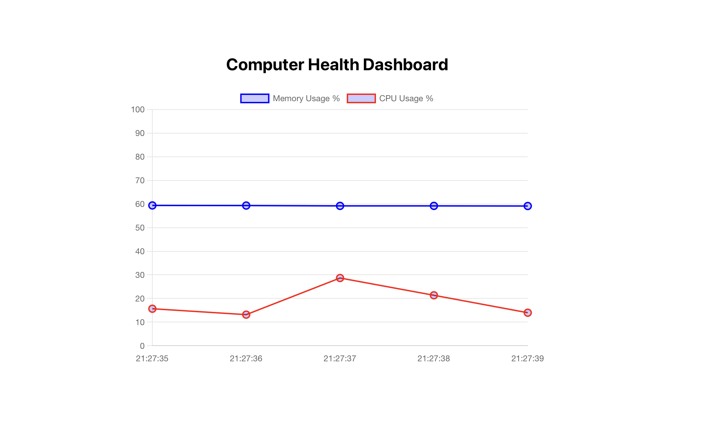
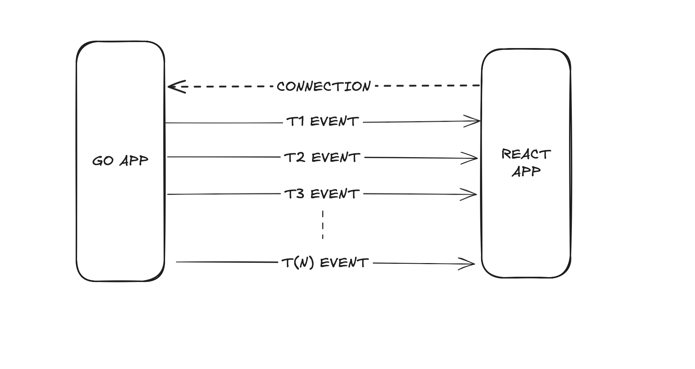

# Server Sent Events

## Dashboard UI

## Arthitecture

_Server Sent Events: SSE_

### What is SSE
Server Sent Events is a technology that allows a server to push real-time updates to a web client over a single HTTP connection. It is a one-way communication mechanism where the server can continuously send updates to the client without the client having to request them repeatedly.

### How SSE Works
1-) The web client creates an event stream connection to the server using Event Source

2-) The server sends events on this connection whenever data is avaiable

3-) The client processes the incoming data and updates the UI accordingly

### Key Features of SSE

**Unidirectional**: Only the server can send messages to the client (unlike WebSockets, which are bidirectional).

**Persistent connection**: Uses a single HTTP connection that stays open for continuous updates.

**Lightweight**: More efficient than long polling because it doesn’t require repeated requests.

**Automatic Reconnection**: If the connection is lost, browsers automatically attempt to reconnect.
